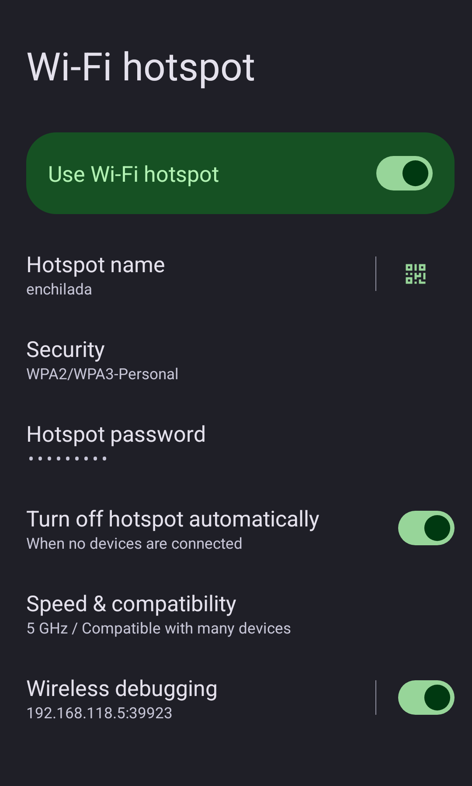

<div align="center">
  

# Hotspot Wireless Debugging

Use Android Wireless Debugging (ADB over Wi‑Fi with pairing/TLS) while your phone is the hotspot host.
</div>

## What this module does

Android normally expects the phone to be connected to Wi‑Fi as a client before Wireless Debugging can stay enabled.

This module changes that behavior so Wireless Debugging can stay available when your phone is running a hotspot (SoftAP).

## Who this is for

- You tether other devices to your phone hotspot
- You want native Wireless Debugging (pair + connect), not plain `adb tcpip`
- You use a rooted phone with an Xposed-compatible framework

## Compatibility (current baseline)

- Android: **15 supported**
- Android: **16 expected to work** (framework-side branch drift still possible)
- Module type: **libxposed API 101 module**
- Scopes required: `android` and `com.android.settings`

## Requirements

- Rooted device
- Zygisk-enabled environment (Magisk or KernelSU setup)
- Compatible Xposed runtime

## Install

1. Download the latest APK from [Releases](https://github.com/cbkii/hotspotadb/releases).
2. Install the APK.
3. Enable the module for both scopes:
   - `android`
   - `com.android.settings`
4. Reboot.

## Use

1. Turn on hotspot.
2. Open hotspot settings or Developer options and enable Wireless Debugging.
3. Pair from client:
   - `adb pair <ip>:<pairing_port> <pairing_code>`
4. Connect:
   - `adb connect <ip>:<port>`

## Troubleshooting (quick)

Check logs:

```bash
adb logcat -s HotspotAdb
```

If it fails, include these in your bug report:
- device model
- Android version
- ROM
- root + framework versions
- relevant `HotspotAdb` logs

## Advanced technical notes

### Hook domains

1. **Settings process** (`com.android.settings`)
   - keeps UI enabled in hotspot mode
   - shows hotspot-side IP for ADB
   - injects hotspot settings entry behavior
2. **Framework process** (`android` / `system_server`)
   - supplies hotspot connection info to ADB internals
   - blocks framework network-change paths that otherwise disable hotspot wireless debugging

### Behavior details

- Trust identity uses a synthetic stable BSSID to avoid trust reset on each hotspot cycle.
- Hotspot detection and IP discovery are heuristic by design.

## Build from source

Requires JDK 21 and Android SDK API 36.

```bash
./gradlew ktlintCheck detekt assembleDebug
```

## Acknowledgements

This project started from the original work by **Dr. Serasprout** and contributors.

- Original upstream project: [droserasprout/io.drsr.hotspotadb](https://github.com/droserasprout/io.drsr.hotspotadb)
- Upstream contributors: [Contributors graph](https://github.com/droserasprout/io.drsr.hotspotadb/graphs/contributors)

Thank you to the upstream maintainers and contributors for the foundation this standalone repository builds on.

## License

[GPL-3.0](LICENSE)
