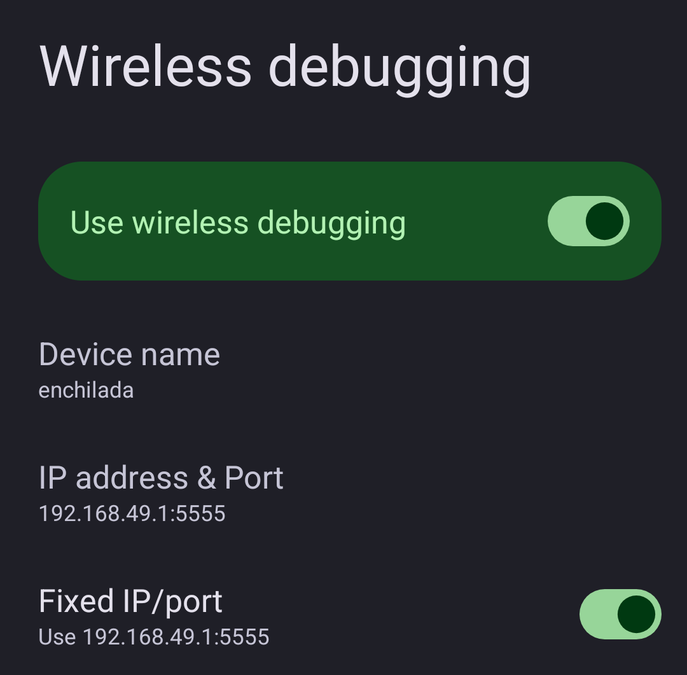

# Hotspot Wireless Debugging

Xposed module that allows Wireless Debugging (ADB over Wi-Fi) to work over Wi-Fi Hotspot on Android 15/16.

Android 11+ only enables Wireless Debugging when the device is connected to Wi-Fi as a client. This module hooks the Settings app and system framework to bypass that restriction, so hotspot guests can connect via ADB.

## Requirements

- Android 15/16
- Magisk or other Zygisk implementation
- LSPosed/Vector

### Tested configurations

| Device | Android | ROM | Zygisk | Xposed |
| --- | --- | --- | --- | -- |
| enchilada | 15 | LineageOS 22.2 | Magisk 30.7 </br> NeoZygisk 2.3 | LSPosed 1.9.2 </br> Vector 2.0 |
| tucana | 16 | LineageOS 23.2 | Magisk 30.7 | Vector 2.0 |

If this module works (or not) on your device/ROM, please [open an issue](https://github.com/droserasprout/io.drsr.hotspotadb/issues) with details!

## Installation

Grab the latest APK from Xposed Module Repo, [GitHub Releases](https://github.com/droserasprout/io.drsr.hotspotadb/releases), or [build from source](#building-from-source).

1. Install the APK
2. Enable the module in LSPosed for two scopes:
   - `com.android.settings`
   - `android` (System Framework)
3. Reboot

## Usage

1. Enable Wi-Fi Hotspot
2. Use the Wireless Debugging toggle on the hotspot settings screen, or go to Developer Options > Wireless Debugging
3. Pair your client device: `adb pair <ip>:<pairing_port> <pairing_code>`
4. Connect: `adb connect <ip>:<port>`

### Fixed IP/port (optional)



Flip the **Fixed IP/port** toggle on the Wireless Debugging screen to always use `192.168.49.1:5555` for `adb connect`. You can then script `adb connect 192.168.49.1:5555` without caring about mDNS support in your `adb` build. Pairing still uses the dynamic port shown on screen (pairing is a one-time step).

How it works when enabled:

- `192.168.49.1/24` is aliased on the hotspot interface via netd (secondary address, primary subnet is untouched)
- A TCP proxy in `system_server` listens on `0.0.0.0:5555` and forwards to adbd's ephemeral TLS port — TLS is preserved end-to-end, the proxy is just a byte pipe

Trade-off: if your upstream network is also on `192.168.49.0/24`, aliasing the same subnet on the hotspot will cause a routing collision. Leave the toggle off in that case.

## Building from source

Requires JDK 21 and Android SDK.

```shell
make build     # build debug APK
make install   # install via Gradle
make clean     # clean build artifacts
```

## Other solutions

[Magisk-WiFiADB](https://github.com/mrh929/magisk-wifiadb) — Magisk module, enables legacy `adb tcpip` on boot. Simpler (just Magisk, any Android), but unencrypted and not hotspot-aware. This module hooks native Wireless Debugging (TLS, pairing) with Settings UI, but needs LSPosed and Android 15/16.

## License

[GPL-3.0](LICENSE)
